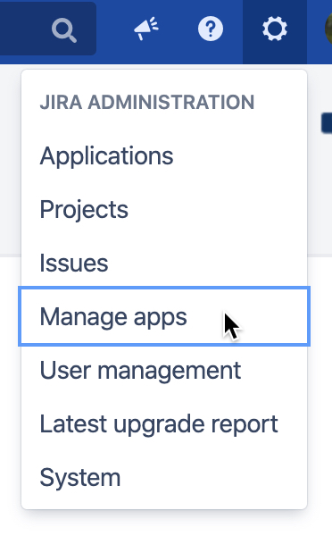
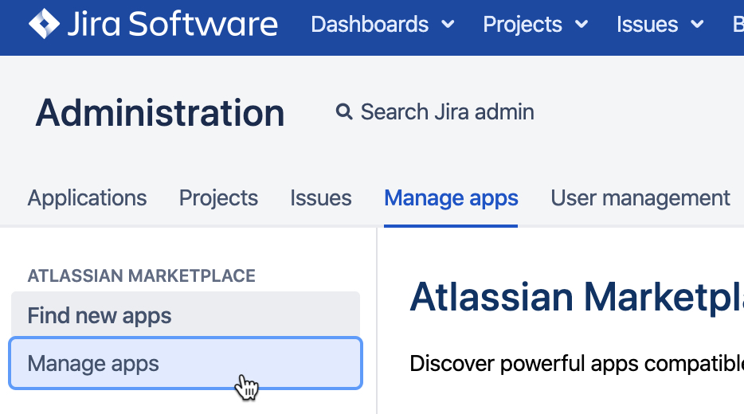
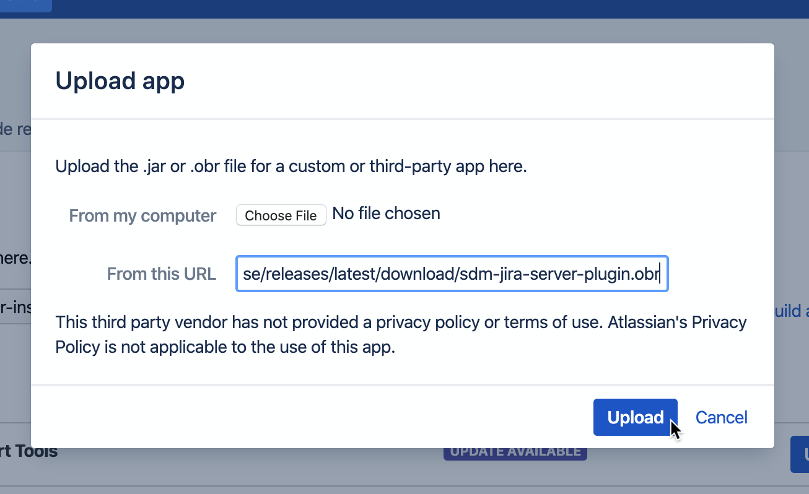

# CloudBees SDM Jira Server Plugin

This repository contains the stable versions of the CloudBees SDM Jira Server Plugin which can be installed on a Jira Server instance to allow data to be collected by SDM. For more information on the CloudBees SDM Jira Server integration, please visit the link:https://docs.cloudbees.com/docs/cloudbees-sdm/latest/cloudbees-administer/integrations/jira-server-integration[official CloudBees documentation].

## Instructions

. Navigate to the manage apps section of your Jira Server instance.
+
.Dropdown option for "Manage apps"
[#img-sunset]
[caption=""]

. Select the tab on the left labeled *Manage apps*
+
.Sidebar tab for "Manage apps"
[#img-sunset]
[caption=""]

. Select the link on the right to *Upload app*
+
.Link for "Upload app"
[#img-sunset]
[caption=""]
image::./images/JiraServer_Upload_App.png[]

. Enter the following URL into the "From this URL" textbox and click *Upload*
+
`https://github.com/cloudbees/sdm-jira-server-plugin-release/releases/latest/download/sdm-jira-server-plugin.obr`
+
.Link for "Upload app"
[#img-sunset]
[caption=""]

[NOTE]
====
This link will pull the latest version of the CloudBees SDM Jira Server Plugin. To choose a specific version, download it from link:https://github.com/cloudbees/sdm-jira-server-plugin-release/releases[Releases].
====

. The latest version of the plugin will be fetched and installed onto your Jira Server instance. For more information on how to associate this server with your CloudBees SDM account, please see visit the link:https://docs.cloudbees.com/docs/cloudbees-sdm/latest/cloudbees-administer/integrations/jira-server-integration[official CloudBees documentation].